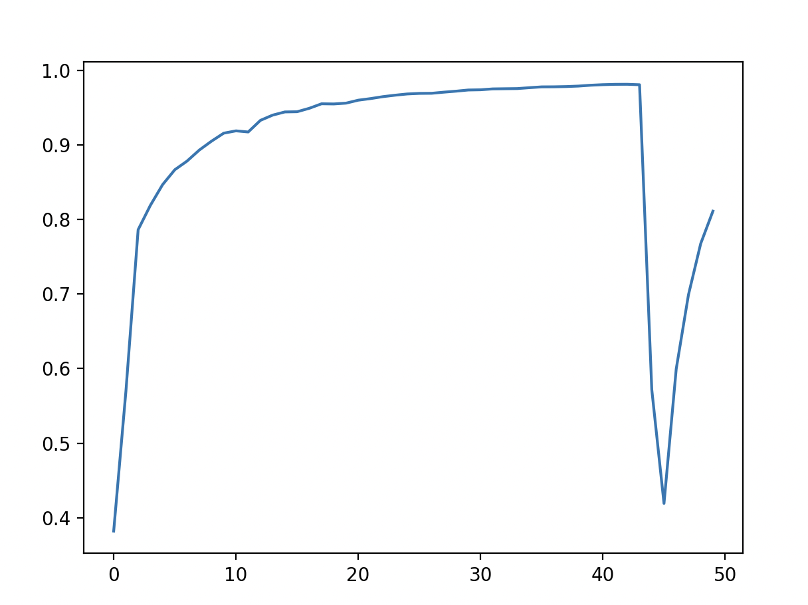
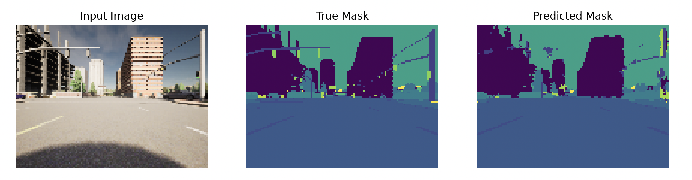

# Semantic Segmentation with UNet

This repository contains code for implementing Semantic Segmentation using the UNet architecture. Semantic Segmentation is a computer vision task where the goal is to segment and classify each pixel in an image into a specific class. UNet is a popular architecture for this task, known for its effectiveness in capturing both global and local information.

## Overview

Semantic segmentation is a crucial task in various fields such as medical imaging, autonomous driving, and satellite image analysis. This repository provides an implementation of UNet, a deep learning architecture specifically designed for semantic segmentation tasks.

Uses CARLA self-driving car [dataset](https://paperswithcode.com/dataset/carla), The split train/val/test consisted of 0.7/0.2/0.1 . Applies sparse categorical crossentropy for pixelwise prediction. The best epoch scored an accuracy of 0.9809 over the training data and 0.9706 over the validation data.



## Contents

- `data/`: The dataset to be downloaded should be contained under this folder, following this hierarchy:
```
    data
    ├── images
    └── masks
```
- `model.py`: Implementation of the UNet architecture.
- `utils/`: Utility functions for data preprocessing, visualization.
- `train.py`: Script for training the UNet model on a dataset.

## Requirements

This was trained on a Macbook Pro M1 (8-core CPU, 14-core GPU, 16-core Neural Engine, 16GB RAM).
- Python 3.x
- Tensorflow & Tensorflow-metal(For MacOS)
- NumPy
- Matplotlib

## Inference Example




